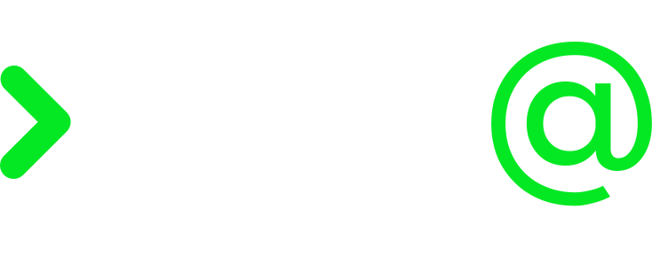
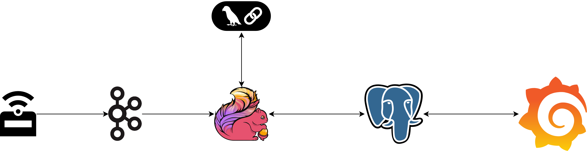

<p align="center">
    <picture>
    <source media="(prefers-color-scheme: dark)" srcset="./assets/img/logo_dark.svg">
    <source media="(prefers-color-scheme: light)" srcset="./assets/img/logo.svg">
    
    </picture>
</p>

# NearYou - Smart Custom Advertising Platform [](https://codecov.io/gh/SWEatUNIPD/NearYou)

Repository relativo al codice sviluppato per il capitolato C4 dell'azienda proponente Sync Lab S.r.L. per il progetto
didattico di Ingegneria del Software A.A. 2024/25 del CdL Triennale in Informatica (L31) dell'Università degli Studi di
Padova.

## Tecnologie adottate

Le tecnologie adottate dal nostro _Minimum Viable Product_ sono:

- **TypeScript** per la simulazione dei sensori che interagiscono con il sistema, inviando messaggi in formato JSON (
  serializzati) al sistema tramite un _message broker_ (nel nostro caso **Apache Kafka**) nel seguente formato:
  ```json
  {
    "rentId": identificator_of_the_rent,
    "latitude": latitude,
    "longitude": longitude,
    "timestamp": timestamp
  }
  ```
- **Apache Flink** (Java) per sviluppare il cuore pulsante, ovvero il sistema a cui viene delegato il compito di
  processare in tempo reale lo stream di dati in entrata provenienti dai sensori installati sui mezzi (nel nostro caso
  specifico, i
  simulatori) e arricchirli in maniera tale da inviare un prompt alla LLM il più completo possibile. Oltre ad Apache
  Flink, per lo sviluppo del sistema sono state utilizzate altre tecnologie. Meritano di essere menzionate:
    - [*R2DBC*](https://r2dbc.io/), ovvero un _driver_ studiato appositamente secondo la specifica dei _Reactive
      Streams_, fornendo a noi un API **non-bloccante** per interagire con il _database_, come richiesto da Apache Flink
      per
      le [richieste asincrone](https://nightlies.apache.org/flink/flink-docs-master/docs/dev/datastream/operators/asyncio/#async-io-api)
    - [**Project Reactor**](https://projectreactor.io/) libreria per la gestione degli _stream_, non bloccante,
      utilizzata per realizzare le richieste asincrone al nostro _database_ e alla LLM per la generazione dell'annuncio
    - [**LangChain4j**](https://docs.langchain4j.dev/) _porting_ di LangChain per Java per effettuare le generazioni
      tramite la LLM
- **Grafana** come _tool_ di osservabilità per i dati che vengono mandati dai sensori e le generazioni che vengono effettuate per i vari punti di interesse registrati in _database_.



## Come avviare il sistema

Il sistema presenta un file `compose.yml` necessario ad avviare l'intero sistema.

Per avviare il sistema, sarà quindi necessario eseguire semplicemente il comando `docker compose up -d`.

Per terminare il sistema, basterà eseguire il comando `docker compose down -v`.

## Ambiente di sviluppo
Viene demandata a Docker anche la compilazione del _job_ per Apache Flink (esente da test).

### Flink Job
Per eseguire i test (compilando il _job_ mediante il comando `mvn clean package` o eseguendo esplicitamente i test con `mvn test`) sarà necessario aver installato Maven e avere un Docker Engine avviato all'interno dell'ambiente dove il _job_ verrà testato in maniera tale da poter eseguire i test di integrazione mediante [TestContainers](https://testcontainers.com/).


### Simulatore
Per eseguire in locale il simulatore, sarà necessario aver installato Node all'interno del proprio ambiente di sviluppo (viene fornito il file `.nvmrc` contenente la versione di Node).

Per avviare il simulatore, basterà eseguire il comando `npm run app`.

Per avviare invece i relativi test, sarà necessario eseguire il comando `npm test`.

## Componenti del gruppo

| Nominativo        | Matricola |
|:------------------|:---------:|
| Andrea Perozzo    |  2082849  |
| Andrea Precoma    |  2068227  |
| Davide Marin      |  2068234  |
| Davide Martinelli |  2034341  |
| Davide Picello    |  2034825  |
| Klaudio Merja     |  2075538  |
| Riccardo Milan    |  2068231  |
